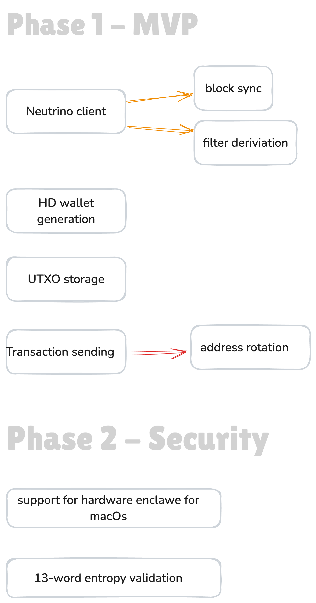

# Satellion - open-source community driven bitcoin wallet

**Annotation**

We will develop a lightweight, secure, and transparent command-line Bitcoin wallet featuring a friendly, step-by-step ask-and-confirm interaction model. The project is non-profit and aimed primarily at experienced users who want straightforward, trustworthy self-custody without trading functions or unnecessary complexity.

The initial release will support Bitcoin only; consideration of other assets will be deferred until much later, and only after careful evaluation.

Focus: macOS and Linux systems, with hierarchical deterministic (HD) wallet generation and support for modern Bitcoin address types (SegWit and Taproot) exclusively.

## Principles
- *Neutrino Client Protocol*
  No dependency on centralized RPC servers. By embedding the open-source Neutrino client (BIP157/158) from Lightning Labs, our wallet independently verifies compact filters and blocks. This raises the trust model above Electrum-style servers and aligns us with Bitcoin’s decentralized ethos.
- *Simplicity by Design.*
  Minimize attack surface and cognitive load. Every interaction is step-by-step with safe defaults, clear prompts, and no hidden “expert” traps.
- *Privacy & Security by Default.*
  No telemetry. Deterministic address rotation. Strong key encryption using OS-level secure enclaves. Always assume the user’s device can be lost or compromised.
- *Open & Verifiable.*
  Roadmaps, discussions, and funding are public. Builds are reproducible and releases are signed. No “black box” binaries or hidden backdoors.
- *Bitcoin-Native, Nothing Else.*
  Hierarchical Deterministic wallets (BIP32/39) with modern address standards only: SegWit (bech32) and Taproot. No legacy formats, no altcoins, no distractions.

---

#### Neutrino Client Protocol

BIP157 and BIP158 together define a privacy-focused, efficient protocol for lightweight Bitcoin clients, improving on legacy SPV (Simplified Payment Verification, BIP37).

##### Problem
- **Legacy SPV (BIP37):** Clients use Bloom filters to request only relevant transactions from full nodes.
- **Drawbacks:** Bloom filters can leak which addresses you’re interested in and are bandwidth-inefficient.

##### Solution
 **BIP158 – Compact Block Filters**
- Full nodes build a Golomb-Rice filter for each block.
- Each filter summarizes the addresses and scripts in the block.
- Filters are much smaller than full blocks, making them efficient to download.

**BIP157 – Client/Server Interaction**
- Defines how clients request and receive filters from full nodes.
- Clients download block headers and filters, then check locally for relevant transactions.
- If a filter matches, the client fetches the full block or just the relevant transactions.

**Benefits**
- **Privacy:** Clients don’t reveal their addresses to the server; filtering happens locally.
- **Efficiency:** Less data transferred compared to Bloom filters.
- **Scalability:** Full nodes don’t need to process custom filters for each client.
- **Security:** Clients can query multiple peers and only need one honest node for correct results.

**Adoption**
- Used by wallets such as Lightning Labs’ Neutrino, BTCPay Server mobile apps, and several Lightning Network wallets.

### Roadmap
